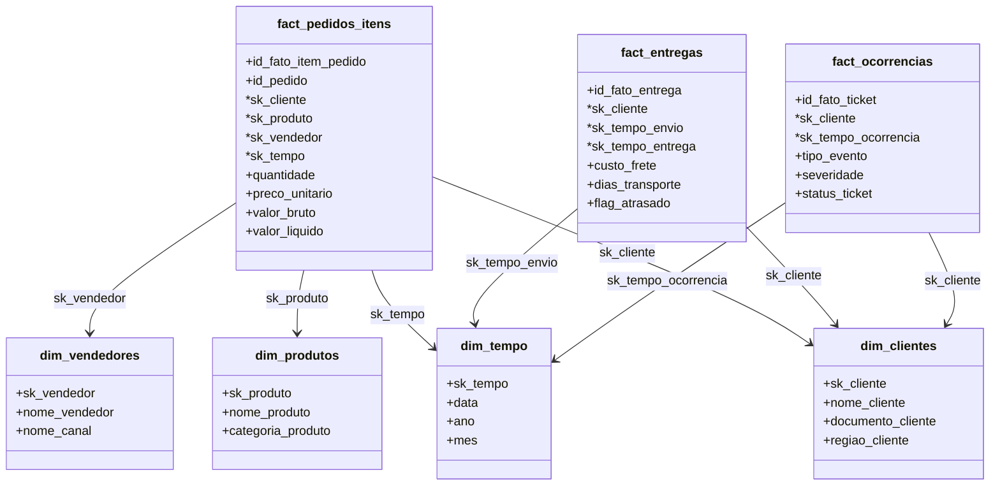
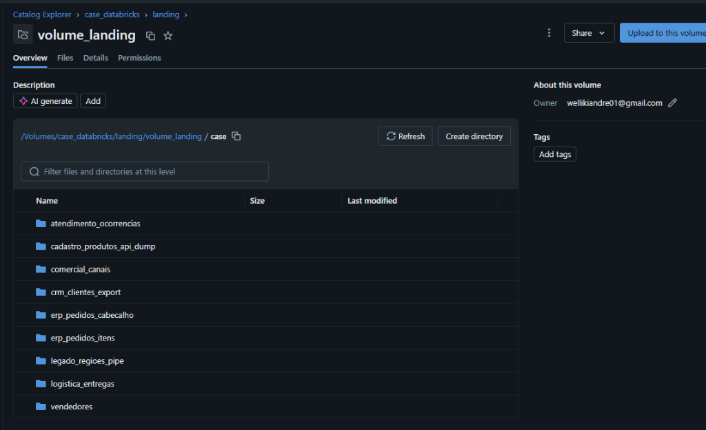
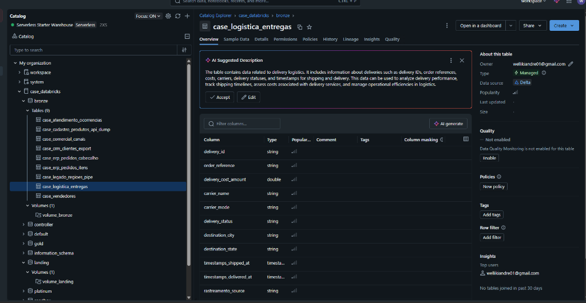
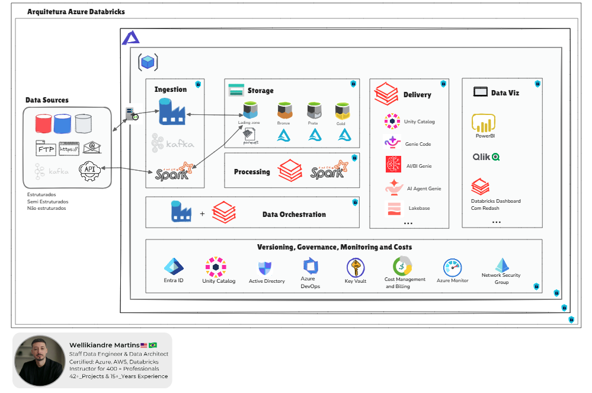
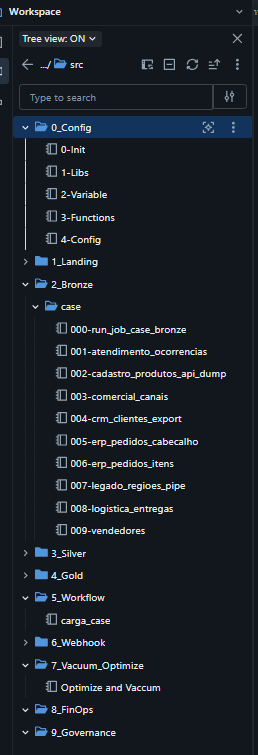

# Plataforma Corporativa de Dados e Modelagem Dimensional no Databricks
## Guia de Arquitetura de Referência e Especificação do Case Técnico

[](https://community.cloud.databricks.com/)
[](https://spark.apache.org/)
[](https://delta.io/)

Este documento apresenta a especificação técnica e de arquitetura do projeto de engenharia de dados (data engineering) desenvolvido para o Databricks. A solução foi projetada sob os princípios de alta escalabilidade (scalability), governança centralizada (data governance) e otimização de custos na nuvem (cloud cost management - FinOps).

---

> [!IMPORTANT]
> **Premissa de Entrega e Posicionamento Profissional**
> 
> A solução desenvolvida para este teste técnico está implementada integralmente sob a arquitetura de referência detalhada a seguir.
> 
> Mesmo ciente de que o foco central deste case é a avaliação de minhas habilidades técnicas (skills evaluation), assumi como premissa pessoal a entrega de **valor incremental (incremental value)**. Por este motivo, meu objetivo aqui não foi apenas documentar estritamente as regras básicas solicitadas pelo enunciado, mas sim construir e documentar o projeto sob o mesmo padrão de excelência de mercado que venho aplicando, liderando e ensinando em grandes operações de dados há anos.

---

## Menu de Acesso Rápido (Quick Access Links)

Para navegar diretamente para os documentos detalhados, clique nos botões abaixo:

<p align="left">
  <a href="file:///home/wellikiandre/academy/dir/case_databricks/docs/technical_documentation.md">
    
  </a>
  &nbsp;&nbsp;
  <a href="file:///home/wellikiandre/academy/dir/case_databricks/docs/executive_summary.md">
    
  </a>
</p>

*   [Especificação de Orquestração YAML](file:///home/wellikiandre/academy/dir/case_databricks/src/5_Workflow/carga_case.yaml): Configuração do Databricks Workflow para implantação automática.

---

## 1. Arquitetura do Modelo Dimensional - Camada Gold (Gold Dimensional Model)

A camada Gold (Curated/BI) foi estruturada sob o conceito de **esquema estrela (star schema)** para facilitar a exploração analítica por ferramentas de Business Intelligence (BI) e permitir a integração natural de consultas em linguagem natural (natural language queries) através do **Databricks AI/BI Genie**.

### Diagrama de Relacionamento de Entidades (Entity-Relationship Diagram)



### Especificação Conceitual e Dicionário de Dados Gold (Gold Dimensional Modeling)

Para facilitar a exploração analítica por ferramentas de Business Intelligence (BI) e pelo Databricks Genie AI, a camada Gold foi modelada em detalhes com as seguintes tabelas de dimensão (dimension tables) e tabelas fato (fact tables):

#### Tabelas de Dimensão (Dimension Tables)

##### `dim_clientes`
*   **sk_cliente (Primary Key)**: Chave substituta (surrogate key) gerada via hash SHA-256 no ID do cliente para isolamento do ID transacional.
*   **id_cliente**: ID de negócio original do cliente.
*   **nome_cliente**: Nome completo.
*   **email_cliente**: E-mail tratado.
*   **documento_cliente**: CPF/CNPJ higienizado.
*   **tipo_documento_cliente**: Classificação do documento.
*   **uf_cliente**: Unidade Federativa.
*   **regiao_cliente**: Região comercial unificada a partir dos dados geográficos do legado.
*   **data_cadastro**: Data de ingresso do cliente.

##### `dim_produtos`
*   **sk_produto (Primary Key)**: Hash SHA-256 sobre o ID do produto.
*   **id_produto**: ID de negócio do produto.
*   **nome_produto**: Descrição do produto.
*   **categoria_produto**: Categoria de alto nível.
*   **subcategoria_produto**: Subcategoria.
*   **status_produto**: Situação atual do produto.
*   **preco_tabela**: Preço de tabela sugerido.
*   **moeda**: Código de moeda.

##### `dim_vendedores`
*   **sk_vendedor (Primary Key)**: Hash SHA-256 sobre o ID do vendedor.
*   **id_vendedor**: ID numérico.
*   **nome_vendedor**: Nome do vendedor.
*   **nome_canal**: Nome do canal comercial ao qual o vendedor pertence.
*   **email_vendedor**: E-mail do vendedor.

##### `dim_tempo`
*   **sk_tempo (Primary Key)**: Chave inteira (surrogate key) no formato `yyyyMMdd`.
*   **data**: Tipo Date.
*   **ano**, **mes**, **dia**, **trimestre**, **dia_semana**, **nome_mes**, **nome_dia_semana**: Atributos temporais ricos.

#### Tabelas Fato (Fact Tables)

##### `fact_pedidos_itens`
Contém as transações de vendas no nível mais granular (item por pedido).
*   **id_fato_item_pedido (Primary Key)**: Hash SHA-256 composto pela junção de pedido e produto.
*   **id_pedido**: Número do pedido.
*   **sk_cliente**, **sk_produto**, **sk_vendedor**, **sk_tempo**: Chaves estrangeiras associadas às tabelas de dimensão.
*   **quantidade**: Volume físico vendido.
*   **preco_unitario**: Preço praticado na venda.
*   **valor_bruto**: Receita bruta (`quantidade * preco_unitario`).
*   **valor_liquido**: Receita líquida ajustada (valor zerado no caso de pedidos cancelados, servindo como métrica financeira confiável).
*   **status_pedido_evento**: Status de finalização do pedido.

##### `fact_entregas`
Métricas de entrega da cadeia de suprimentos (supply chain).
*   **id_fato_entrega (Primary Key)**: ID único da entrega.
*   **id_pedido**: ID do pedido de origem.
*   **sk_cliente**: Chave do cliente destinatário.
*   **sk_tempo_envio**, **sk_tempo_entrega**: Conexões com a dimensão tempo.
*   **status_entrega**: Status do tráfego (ex: Entregue, Cancelado, Atrasado).
*   **transportadora**: Parceiro logístico.
*   **modalidade_transporte**: Modal.
*   **custo_frete**: Custo de envio logístico.
*   **dias_transporte**: Tempo decorrido em trânsito.
*   **flag_atrasado**: Indicador binário (`1` para atrasado, `0` para no prazo).

##### `fact_ocorrencias`
Monitoramento de pós-venda e satisfação do cliente.
*   **id_fato_ticket (Primary Key)**: ID do ticket.
*   **id_pedido**: Pedido associado ao chamado.
*   **sk_cliente**: Cliente que abriu a ocorrência.
*   **sk_tempo_ocorrencia**: Data de abertura do incidente.
*   **tipo_evento**: Categoria da ocorrência.
*   **severidade**: Impacto.
*   **status_ticket**: Situação de resolução.

---

## 2. Ingestão e Processamento - Camadas Bronze e Silver

O processamento segue a arquitetura de medalhão (Medallion Architecture) dividida em:

### Landing para Bronze (Raw Replication)
*   **Estrutura de Landing Zone padronizada**: A zona de pouso (Landing Zone) foi implementada utilizando volumes (Volumes) do Unity Catalog no Databricks, sob o caminho `/Volumes/case_databricks/landing/volume_landing/case/`, onde os dados brutos de cada entidade de negócio são depositados em suas respectivas pastas.

    
*   **Ingestão via Auto Loader**: Utilização do Auto Loader do Databricks com `cloudFiles` para ler em tempo real (streaming) ou lotes frequentes arquivos CSV, JSON e texto da landing zone.
*   **Replicação Exata**: Armazenamento em tabelas Delta (Delta Tables) de forma idêntica à origem, acrescentando metadados de auditoria técnica como `rastreamento_source` (caminho físico do arquivo de entrada) e `ingestion_date_brasilia` (carimbo de data e hora ajustado para o fuso local). As tabelas são criadas de forma particionada sob o esquema `bronze` no Unity Catalog.

    

### Bronze para Silver (Data Quality & Cleaning)
As transformações aplicadas garantem a qualidade e a padronização dos dados antes de sua agregação analítica. Para cada entidade, aplicou-se um pipeline de limpeza (cleaning pipeline) específico:

*   **Clientes CRM (`crm_clientes`)**:
    *   Limpeza do documento (CPF/CNPJ) através de expressões regulares (regex) para remover caracteres de formatação (como pontos e traços).
    *   Padronização do campo e-mail em letras minúsculas (lowercase).
    *   Tratamento de duplicidade através do particionamento por `id_cliente` no nível do banco de dados (database deduplication).
*   **Produtos (`cadastro_produtos`)**:
    *   Conversão de tipo (casting) de `list_price` para formato numérico de precisão fixa (`DecimalType(10, 2)`).
    *   Tratamento de nulos em campos de categorias aplicando valor padrão "Outros" para evitar distorções na segmentação de relatórios.
    *   Deduplicação baseada no produto mais recentemente atualizado com a janela do Spark (`Window.partitionBy("product_id").orderBy(col("updated_at").desc())`).
*   **Canais e Vendedores**:
    *   Normalização de chaves primárias e chaves estrangeiras (foreign keys) para tipos de dados inteiros comuns.
    *   Ajuste de strings (remover espaços sobressalentes).
*   **Logística de Entregas (`logistica_entregas`)**:
    *   Conversão de tipo (casting) das strings de tempo para tipo Timestamp.
    *   Tratamento de nulos no status do rastreamento preenchendo com "PENDENTE".
*   **Atendimento Ocorrências (`atendimento_ocorrencias`)**:
    *   Conversão de tipo (casting) de datas de criação dos tickets.
    *   Filtro e deduplicação de ocorrências concorrentes por `ticket_id`, mantendo a última atualização registrada.

---

## 3. Destaques Arquiteturais e Otimizações de Custo (FinOps & Performance)

*   **Uso de Liquid Clustering**: Em substituição ao particionamento tradicional (particionando fisicamente o lake em diretórios por data), a camada Gold utiliza Liquid Clustering (`CLUSTER BY`) nas tabelas Delta. Isso otimiza os planos de execução (query execution plans) do Spark ao realizar buscas filtradas por região, produto ou período e evita o problema de pequenos arquivos (small files problem).
*   **Orquestração Assíncrona via APIs**: A arquitetura de workflow foi desacoplada de forma orientada a eventos. O orquestrador externo apenas dispara as chamadas de Job e libera o canal de processamento, em vez de reter unidades de integração ativas aguardando a finalização. Isso proporciona reduções de custos na nuvem de **27% a 90%** (dependendo do volume de dados).
*   **Chaves de Fallback**: Caso ocorram chaves estrangeiras órfãs durante o enriquecimento de tabelas fato na Gold, o processo mapeia e resolve as chaves substitutas para registros de falha padrão (`-1` ou hash de "Não Identificado"), garantindo a integridade referencial sem descartar registros transacionais importantes.

---

## 4. Estrutura de Pastas do Projeto (Workspace Folder Structure)

O design de pastas do workspace Databricks é desacoplado de nuvem física, permitindo a portabilidade a qualquer ambiente de nuvem pública (AWS, GCP ou Azure):



| Pasta | Componente | Descrição Técnica e Objetivo de Engenharia |
| :--- | :--- | :--- |
| **`0_Config`** | Configurações e Inicialização | Centraliza o carregamento de dependências, bibliotecas, variáveis globais e parametrização dinâmica de ambientes (DEV, HML, PRD). |
| **`1_Landing`** | Entrada de Dados (Landing) | Ponto de contato físico inicial com arquivos de origem brutos. |
| **`2_Bronze`** | Camada Bronze (Raw Delta) | Replicação exata dos dados em tabelas Delta no formato de adição contínua (append-only) com metadados. |
| **`3_Silver`** | Camada Silver (Cleansed Delta) | Aplicação de regras de qualidade, conversão de tipos, deduplicação e alinhamento de esquemas. |
| **`4_Gold`** | Camada Gold (Curated/BI) | Modelagem analítica final baseada em Star Schema otimizada para o consumo de dashboards e IA. |
| **`5_Workflow`** | Orquestração e Pipelines | Notebooks de automação de pipelines de ponta a ponta e integração com orquestradores. |
| **`6_Webhook`** | Notificações e Alertas | Webhooks para o envio de status e erros das cargas de dados em tempo real para o Slack/Teams. |
| **`7_Vacuum_Optimize`**| Manutenção e Performance | Automação das rotinas de VACUUM e OPTIMIZE para otimizar leitura e reduzir fragmentação. |
| **`8_FinOps`** | Finanças na Nuvem (FinOps) | Scripts focados na eficiência financeira e redução de desperdício em clusters. |
| **`9_Governanca`** | Governança e Segurança | Notebooks dedicados ao mascaramento de dados (data masking) e conformidade (LGPD/GDPR). |



---

## 5. Estrutura de Entregas - Notebooks e Códigos (Project Deliverables)

Os notebooks de processamento e configurações criados estão organizados nas respectivas pastas:

### Configurações de Ambiente — [src/0_Config/](file:///home/wellikiandre/academy/dir/case_databricks/src/0_Config/)
*   `0-Init.ipynb`: Inicialização comum de rotinas.
*   `1-Libs.ipynb`: Carregamento de dependências e bibliotecas Python.
*   `2-Variable.ipynb`: Definição de caminhos de volumes e esquemas físicos do Unity Catalog.
*   `3-Functions.ipynb`: Central de funções utilitárias globais (como `process_data`, `process_fact` e `optimize_tables`).
*   `4-Config.ipynb`: Configurações de Spark Session e propriedades do cluster.

### Pipelines da Camada Silver — [src/3_Silver/](file:///home/wellikiandre/academy/dir/case_databricks/src/3_Silver/)
*   `000-run_job_case_silver.ipynb`: Executa de forma concorrente e paralela todas as cargas da Silver usando threads no Databricks.
*   `001-atendimento_ocorrencias.ipynb`: Processa e limpa ocorrências de suporte pós-venda.
*   `002-cadastro_produtos.ipynb`: Trata o dump JSON da API de produtos.
*   `003-comercial_canais.ipynb`: Higieniza o cadastro de canais comerciais.
*   `004-crm_clientes.ipynb`: Limpa e formata CPFs/CNPJs e cadastros do CRM de clientes.
*   `005-erp_pedidos_cabecalho.ipynb`: Padroniza status e datas de pedidos de vendas.
*   `006-erp_pedidos_itens.ipynb`: Estrutura detalhes de quantidade e valor dos itens comprados.
*   `007-legado_regioes.ipynb`: Normaliza a tabela geográfica de regiões baseada no delimitador pipe.
*   `008-logistica_entregas.ipynb`: Limpa datas logísticas, frete e transportadoras.
*   `009-vendedores.ipynb`: Padroniza e-mails e nomes de cadastro de vendedores.

### Pipelines da Camada Gold — [src/4_Gold/](file:///home/wellikiandre/academy/dir/case_databricks/src/4_Gold/)
*   `000-run_job_case_gold.ipynb`: Orquestra as dimensões da Gold em paralelo e as fatos sequencialmente.
*   `dim_clientes.ipynb`: Monta a dimensão clientes cruzando dados geográficos legados.
*   `dim_produtos.ipynb`: Consolida produtos, preços e categorias.
*   `dim_vendedores.ipynb`: Cria o mapeamento de vendedores e canais comerciais.
*   `dim_tempo.ipynb`: Tabela calendário dinâmica de suporte temporal.
*   `fact_pedidos_itens.ipynb`: Une cabeçalho/itens de pedidos e calcula receita líquida da transação.
*   `fact_entregas`: Consolida métricas de performance logística de transporte.
*   `fact_ocorrencias`: Vincula tickets de suporte abertos a seus respectivos clientes e pedidos.

### Orquestração de Jobs — [src/5_Workflow/](file:///home/wellikiandre/academy/dir/case_databricks/src/5_Workflow/)
*   `carga_case.ipynb`: Ponto de entrada do pipeline unificado.
*   `carga_case.yaml`: Especificação completa do Databricks Workflow Job em formato YAML para deploy via Asset Bundles.

---

## 6. Instruções de Implantação e Execução (Deployment Guide)

Como os códigos foram desenvolvidos e testados no padrão do Databricks Repos integrado aos volumes do Unity Catalog:

1.  Faça o commit e envie as alterações locais para a sua branch remota do GitHub:
    ```bash
    git push origin main
    ```
2.  No Databricks Workspace, acesse o módulo **Repos** (ou **Git Folders**).
3.  Selecione o repositório `case_databricks` e realize o **Pull** para sincronizar as pastas de notebooks em seu workspace.
4.  Certifique-se de que os volumes declarados no notebook `2-Variable.ipynb` existam no Unity Catalog do seu cluster.
5.  Execute o orquestrador geral `/src/5_Workflow/carga_case.ipynb` ou os orquestradores específicos de cada camada:
    *   `/src/3_Silver/000-run_job_case_silver.ipynb`
    *   `/src/4_Gold/000-run_job_case_gold.ipynb`

---

## 7. Portfólio de Casos Reais de Sucesso (FinOps & Performance Cases)

Abaixo estão detalhados os resultados práticos obtidos com a aplicação desta mesma arquitetura e de metodologias avançadas de FinOps no ecossistema de dados, servindo de base de conhecimento para o ambiente corporativo:

1.  **FinOps e Automação no Databricks (Redução de 45.5%):**
    Implementação de rotinas automatizadas e gerenciamento inteligente de clusters na zona de entrega (Delivery Zone), otimizando o gasto computacional de processamento de big data.
    *   [Acesse o Artigo Completo no LinkedIn](https://www.linkedin.com/pulse/automa%C3%A7%C3%A3o-e-finops-economia-de-455-databricks-um-caso-wellikiandre-smopf/)
2.  **Redução de 94% em Custos de Operações de Leitura/Escrita (Data Lake):**
    Otimização de rotinas de leitura e gravação em disco através do ajuste do tamanho de partição de arquivos, prevenção do problema de arquivos pequenos (Small File Problem) e eliminação de leituras desnecessárias de dados.
    *   [Acesse o Artigo Completo no LinkedIn](https://www.linkedin.com/pulse/redu%C3%A7%C3%A3o-de-custo-data-lake-operation-readwhite-wellikiandre/?trackingId=wUfs%2BfJERQa%2B%2B7RzHkscfA%3D%3D)
3.  **Otimização de Carga no Power BI (De 21 minutos e 57 GiB para < 1 minuto e 1.2 GiB):**
    Aceleração dramática na atualização de painéis corporativos aplicando agregação antecipada de dados na camada Gold (Star Schema), reduzindo o volume trafegado (network shuffle) e o consumo de memória RAM do Gateway de dados.
    *   [Acesse a Publicação com Detalhes Técnicos](https://www.linkedin.com/posts/wellikiandre_como-reduzi-57gib-de-dados-por-ciclo-de-activity-7211750188825124864-YCE2?utm_source=share&utm_medium=member_desktop&rcm=ACoAACVzuN0B2yWsXoXg_wqXapwdWiXb-zH4_4U)
4.  **Monitoramento Automatizado de Pipelines com Assistente Webhook:**
    Arquitetura de notificação integrada aos cadernos da camada `6_Webhook` para alertas automáticos de jobs, eliminando a verificação manual constante.
    *   [Acesse a Publicação no LinkedIn](https://www.linkedin.com/feed/update/urn:li:activity:7110645408216813568/)
5.  **Ajustes Finos de Performance em Processamento de Fluxo Contínuo (Streaming Tuning):**
    Melhorias aplicadas a fluxos estruturados (Structured Streaming) para estabilização de vazão de dados (throughput) e redução de latência no Databricks.
    *   [Acesse a Publicação no LinkedIn](https://www.linkedin.com/feed/update/urn:li:activity:7218722493941878784/)
6.  **Ingestão de IoT Near Real-Time Otimizada computacionalmente:**
    Consumo resiliente de sensores com o menor consumo computacional necessário através da otimização de gatilhos (triggers) de processamento de stream do Spark.
    *   [Acesse a Publicação no LinkedIn](https://www.linkedin.com/feed/update/urn:li:activity:7023771647023144960/?updateEntityUrn=urn%3Ali%3Afs_feedUpdate%3A%28V2%2Curn%3Ali%3Aactivity%3A7023771647023144960%29)
