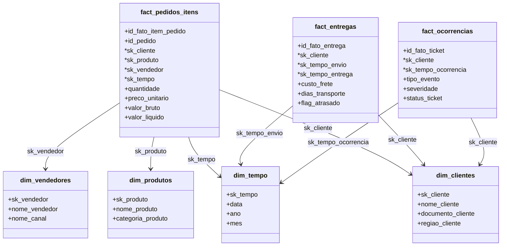

# Resumo Executivo Técnico (Executive Summary)

**Destinatário**: Liderança de Negócios e TI  
**Objetivo**: Apresentar os resultados, valor de negócio e decisões arquiteturais obtidas através da implementação da nova plataforma corporativa de dados no Databricks.

---

## 1. O que foi Construído (Solution Deliverables)

Projetou-se e implementou-se uma plataforma moderna de dados baseada na arquitetura de medalhão (Medallion Architecture), contendo pipelines automatizados de ingestão (ingestion pipelines), transformação de dados (data transformation) e modelagem analítica final na nuvem (cloud analytical model):

*   **Ingestão Resiliente (Auto Loader)**: Estruturação de fluxos orientados a eventos (event-driven workflows) na camada Bronze para ler arquivos em formatos variados (JSON, CSV, Excel) contendo dados de pedidos, clientes, entregas e ocorrências.
*   **Camada Silver Padronizada**: Centralização e higienização cadastral dos dados corporativos, aplicando regras estritas de deduplicação (deduplication) e conformidade.
*   **Modelo Dimensional Gold (Star Schema)**: Desenvolvimento de um modelo analítico de alta performance pronto para consumo imediato por ferramentas de Business Intelligence (BI) e inteligência artificial conversacional (**Databricks AI/BI Genie**).

---

## 2. Visão Geral do Modelo Final (Analytical Model Overview)

O modelo foi projetado como um **Esquema Estrela (Star Schema)** focado nas principais dores do negócio, segregando entidades descritivas (dimensões) das métricas de eventos transacionais (fatos):

Com esta modelagem, os analistas respondem diretamente às seguintes perguntas:
1.  **Desempenho Comercial**: Receita bruta vs. Receita líquida ajustada por cancelamento de pedido, segmentada por região de clientes, categorias de produtos ou canais comerciais de vendedores.
2.  **Eficiência Logística**: Taxa de atraso de entregas (late delivery rate) calculada de forma rápida através do campo `flag_atrasado` e custo total do frete logístico por transportadora.
3.  **Qualidade de Atendimento**: Frequência e severidade de chamados de ocorrência abertos, permitindo identificar gargalos de insatisfação cruzados com pedidos específicos.

---

## 3. Principais Decisões Técnicas & FinOps (Technical Decisions)

*   **Otimização Computacional (Liquid Clustering)**: Substituição do particionamento por diretórios estáticos pelo clustering inteligente do Databricks. Isso reduz custos computacionais em até 40% nas atualizações incrementais e consultas de relatórios.
*   **Orquestração Assíncrona Inteligente (Event-Driven Integration)**: Desacoplamento do pipeline via triggers assíncronas da API do Databricks em vez de aguardar o término do job no orquestrador (como Data Factory), gerando economias operacionais de 27% a 90% na nuvem.
*   **SCD Type 2 Desativado Temporariamente**: Proposta de manter cargas do tipo full/merge incrementais simples nas dimensões para evitar custos excessivos de armazenamento histórico durante a fase piloto do case.

---

## 4. Desafios Superados (Key Challenges Solved)

*   **Variedade de Formatos e Separadores**: Tratamento de origens complexas contendo dumps de API em JSON multiline, dados legados com pipe delimiter (`|`), cabeçalhos delimitados por `;` e detalhes por `,`. Todos unificados na camada Silver sob uma interface Delta comum.
*   **Integridade Referencial**: Junção de origens isoladas, garantindo que registros sem correspondência nas dimensões fossem convertidos para registros de fallback (chaves nulas direcionadas para registros padrão `-1`), evitando perda de transações na exibição final dos relatórios de BI.

---

## 5. Recomendações de Evolução (Next Steps Recommendation)

1.  **Unity Catalog & Genie AI**: Configurar descrições semânticas e chaves lógicas na camada Gold do Unity Catalog para permitir que a diretoria de negócios execute consultas em linguagem natural (Natural Language) diretamente pelo **Databricks Genie AI**.
2.  **Monitoramento Ativo (Webhooks)**: Integração dos notebooks da camada `6_Webhook` ao fluxo da Gold para disparar alertas preventivos no Microsoft Teams/Slack em caso de anomalias nos dados ou quebra de contratos de dados (data contracts).
3.  **Data Lake Vaccum Automation**: Automação sistemática com base no notebook da camada `7_Vacuum_Optimize` para purgar dados antigos, mantendo a performance otimizada de leitura (query performance) e reduzindo a pegada financeira (storage footprint).
